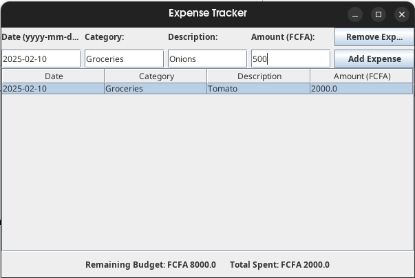

# 💰 Expense Tracker System

A Java-based desktop application that helps users manage and track their income and expenses with ease. Built with Java Swing for the UI.

-orange)
---

## 🚀 Features

- ✅ Add new income and expense entries
- ✅ Categorize transactions (Food, Transport, Bills, etc.)
- ✅ Simple, clean UI built with Java Swing

---

## 🛠️ Technologies Used

- Java (JDK 17)
- Swing (GUI)
---

## 📸 Screenshots

### ➕ Add Income

### 🧾 Main Dashboard

## 📁 Project Structure

ExpenseTracker/
├── src/
│ └── com/bryan/expensetracker/
│ ├── Main.java
├── resources/
├── README.md
├── .gitignore

---

## 📌 Future Improvements

- 📊 Include graphical reports using charts (e.g., JavaFX or JFreeChart)
- 🗃️ Include an SQLite or MySQL backend for information storage
- 📤 Export transaction history to PDF format

---

## 🙋‍♂️ Author

**Bryan Kongne**  
*Junior Software Engineer*  

  
  

